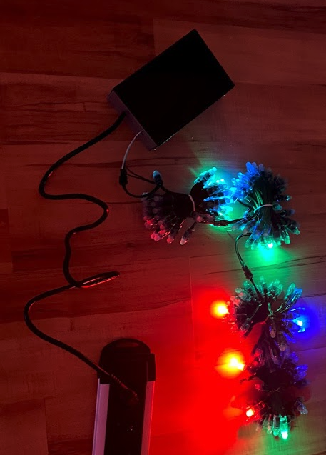

# moonboard

This project contains software and informations to build a home climbing wall with LED support compatible with the popular moonboard. 
This fork has been done while building my home climbing wall. 

***WIP: Project done. Next step: stabilize the code. ***

The [moonboard](https://www.moonboard.com/) smartphone app is build to work with the [moonboard led system](https://moonclimbing.com/moonboard-led-system.html) using bluetooth low energy.
In this project we emulate the behaviour of the box using a rasperry pi and addressable LED stripes. 

# Requirements

Besides the tools, time and money (the climbing holds are the most expensive component) you will need:

- Rapi W Zero with 8GB SD Card - powered over GPIO
- 4x LED Strips: 50x WS2811 LED, 5V, 12mm - custom cable length of 23cm (alternatively 3x 4x LED Strips with standard length of 7cm, use mooboard/led/create_nth_led_layout.py to create custom spacing for LED´s)
- Power supply [meanwell mdr-60-5](https://www.meanwell.com/webapp/product/search.aspx?prod=MDR-60) - (~60mA * 50 * 4 = 12A ==> 60 W for 5V)
- Suitable Case (i.e. TEKO)

# Build Instructions

- [How to Build a Home Climbing Wall](doc/BUILD-WALL.md)
- [How to Build the LED System](doc/BUILD-LEDSYSTEM.md)
- [Software Description](doc/OVERVIEW-SOFTWARE.md)

## Example boards
Free standing foldaway version of moonboard. Moonboard with 150mm kicker and total height of 2900mm, some alteration for 2016 hold setup needs to be done since one hold cannot fit in shortened top panel.

## Troubleshooting
- In case of bluetooth connection problems: make sure to have paired your phone with the raspi once.

## Tested setups
- Raspi W Zero with iPhone 5, 8, X, 11 (iOS >= 14)

# Versions
- v0.28 merged moonboard mini protocol
- v0.27 merged bt fix test
- v0.23 running in gz setup
