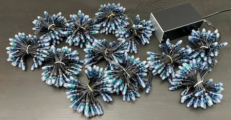
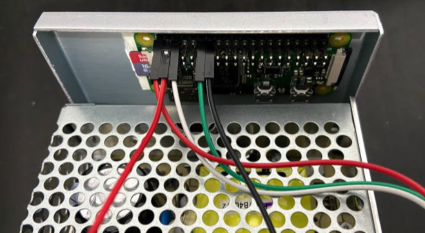
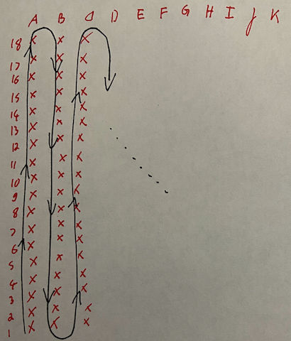

# LED System Build Instructions
The LEDs used are **addressable LED** stripes. 
There are many type of them (i.e. ws281x, ws2801, apa102). 
The original project goes for WS2801, but they were not available in Q4 2020 for me. 
Therefore this project uses WS2811 LEDs. 


## Requirements
Besides the tools, time and money (the climbing holds are the most expensive component) you will need:

- Rapi W Zero with 8GB SD Card - powered over GPIO
- 4x LED Strips: 50x WS2811 LED, 5V, 12mm - custom cable length of 23cm (alternatively 3x 4x LED Strips with standard length of 7cm)
- Power supply [meanwell mdr-60-5](https://www.meanwell.com/webapp/product/search.aspx?prod=MDR-60) - (~60mA * 50 * 4 = 12A ==> 60 W for 5V)
- Suitable Case (i.e. TEKO)


## General Considerations
Bear in mind that 198 LEDs wired with 3-4 cables each mean a lot of soldering work. You probably want to order ready-to-use LED stripes with a 
suitable custom length. 5V leads to higher currents compared to 12V versions of comparable bright LEDs. The voltage drop in such a length will lead
to color mismatches. To fix this the stripes usually have separate voltage connectors on each end in addition to the 3 / 4 pin connection. 



In my case it was not possible to order custom length as of Q4 2020. So I ended up using 3x 4x 50 LED strips and use every 3rd LED. 
The 
patches to the LED layouts are in :latest.
*** FIXME ***
- TBD: configure and test LED_LAYOUT
- TBD: method for initial test
- TBD: method for mounting holds


## Wiring the LED stripes
The WS2811 LED strips have three wires (colors may differ in your case): 
- White = GND
- Red = 5V
- Green = Signal 
- Both the LED and the RASPI are driven by the same power supply (warning: GPIO power on raspi has no fuse)



## Put Holds to moonboard
- There is a mode (CLI) to display the hold setups with leds
```
sudo systemctl stop moonboard.service
cd ~/moonboard/led
sudo /usr/bin/python3  /home/pi/moonboard/led/moonboard.py  --driver_type PiWS281x --holdset "Hold Set A"
```


## Configure the LED addresses FIXME!
- Create a custom layout in <TBD> FIXME moonboard.py
```
sudo systemctl stop moonboard.service
sudo /usr/bin/python3  /home/pi/moonboard/run.py --debug --driver PiWS281x
```
- Running the script in testing mode
```
sudo systemctl stop moonboard.service
cd led
sudo python3 moonboard.py  PiWS281x
```

There are different possibilities how to choose the path of your led strip (cf. layout in the sources). 
There is a scrip in the folder led for creating the address arrays (create_nth_led_layout.py).




## Further readings:
- [Raspberry Pi Zero als LED Strip Controller](https://developer-blog.net/raspberry-pi-zero-als-led-strip-controller)
