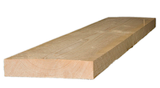

# Climbing Wall Build Instructions

When it comes to home build system walls, there is lots of information on the web these days. Most widely known is the moonboard (other brands as tension or kelter 
board are available, too). It seems like the pattern of 18 rows and 11 columns is most famous, as it has been adapted by the other brands as well. 

## General Considerations

My boundary conditions for the construction of my home climbing wall were: 
- it should used my available space as best as possible (roof), 
- I should be able to do all work on my own without help (including transportation of the wood), 
- the build process must be iterative due to my time constraints (spread out over 7 months),
- I have to rely on other hold sources (delivery bottle neck due to lockdowns)

Popular angles for a home climbing wall are 20° and 40°. The angle of my roof is about 40°, so I had to go for the harder version. 
A thing to consider in advance 
[Training Log Day 2 - Power | Moonboard | 25° & 40° Comparison](https://www.youtube.com/watch?v=wOz9GRdQMNc&feature=youtu.be&ab_channel=AlternativeBeta)
and 
[How and why to train on a moonboard](https://www.climbing.com/skills/how-and-why-to-train-on-the-moonboard/).

## Design the dimensions
After measuring my room in the rooftop I drew a lot of different alternatives where to locate the board and what sizes to choose. 
Dimensions like size of wood, wall, angle, overlap, drill spacings etc. can easily be calculated using an excel sheet (TBD).

Ben Moon himself is cited: "As you have pointed out you could reduce the kick board hight and eliminate the rows although this isn’t a good idea. 
Your best option is to keep all the rows but reduce the spacing between rows. This means you can do all the problems listed on the website but they will be at a slightly easier grade." 
[Forum Post](https://www.mountainproject.com/forum/topic/109397643/moon-board-modifications).

Instead of missing options of more routes etc I choose a spacing of 17cm between the holds and add a horizontal 18th row.

## Material choice
After considering the various obvious options I came across the standard “Baudiele”. 
It is available in 300 x 20 x 4 cm (400 cm is also common). They are cheap, very portable, widely available and thick enough to not need a framing construction. So I came across the final design.

The screws for the climbing holds must be longer (consider 4cm depth of the holes). A good choice are 6cm length for small and 8 cm length for big holds.

## Rough Materials List

| QTY           | Name                     | Image  |
| ------------- |:------------------------:| ------:|
|               | 300 x 20 x 4 cm Baudiele |         |
|               | M10 Drills: Go for the high quality ones with two srews. |  |
|               | Screws for Climbing Holds. ||

### Holds
- Allgäu Holds - Concave Jugs L (Klettergriffe Set) neon-pink
- Allgäu Holds - Sandstein Edges L (Klettergriffe Set)
- Entre Prises Klettergriffset Kineduc
- Entre Prises Klettergriffset Essential Jugs L 3 (ehemals Flakes)
- Entre Prises Klettergriffset Essential Jugs L 2 (ehemals Mini Roof)
- Entre Prises Yangshuo Jugs M 1
- Entre Prises Klettergriffe Essential Jugs L 1 (ehemals Bomber Jugs)

## Further readings:
- [Howto Build a Moonboard](https://www.moonboard.com/how-to-build-your-moonboard/) - Original description
- [BATTLE OF THE BOARDS: MOON, HANG AND CAMPUS](http://eveningsends.com/battle-of-the-boards-moon-hang-and-campus-a-home-gym-review/)
- [Building a Home Climbing Wall](https://www.youtube.com/watch?v=ZZG8lnL_lbA&ab_channel=BreakingBeta) - Very useful description of materials choice and designing dimensions
- [How to Build a Freestanding Mini MoonBoard for Complete Beginners ](https://www.youtube.com/watch?v=HKDwhwOcVSc&ab_channel=JakeKrebs) - Useful description how to design a board with little materials
- [Tips for Building a Moon Board](https://www.youtube.com/watch?v=r-orVA3vWMc&t=1511s&ab_channel=AlanHauser) - Tips for calculations and tools
