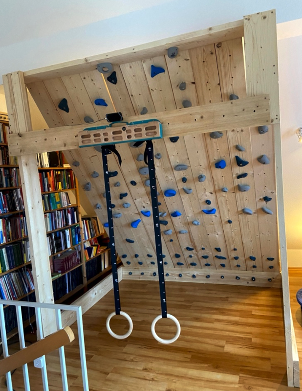
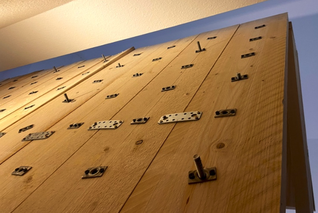
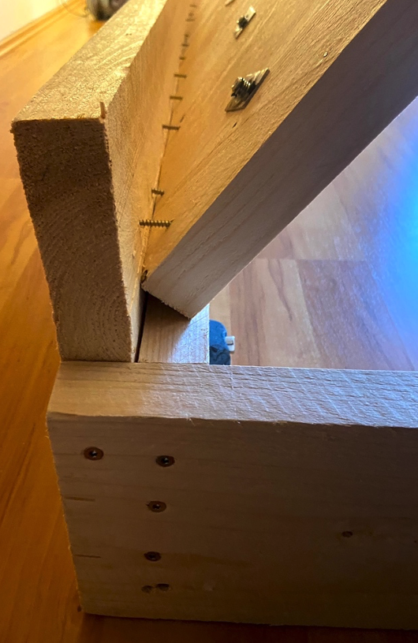
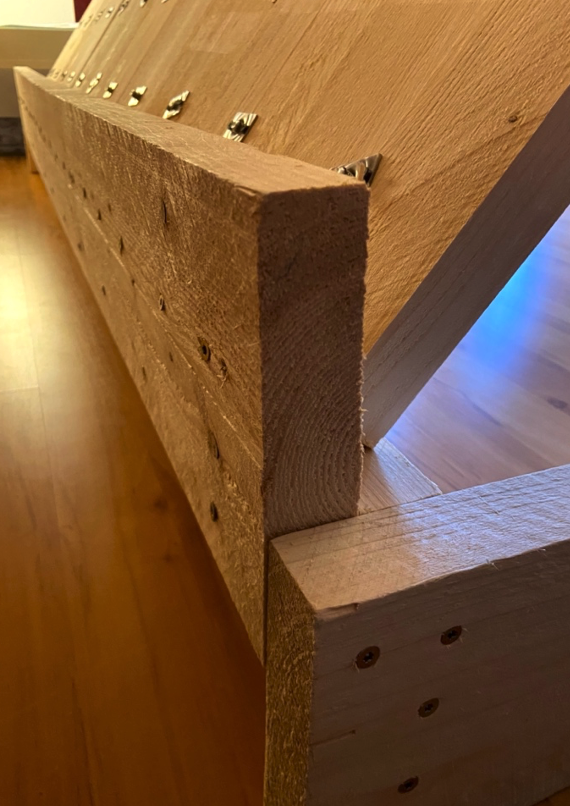
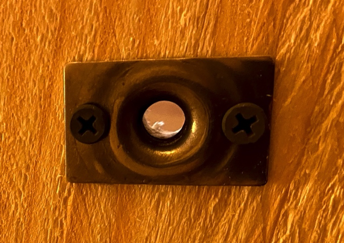

# Climbing Wall Build Instructions

When it comes to home build system walls, there is lots of information on the web these days. Most widely known is the moonboard (other brands as tension or kelter 
board are available, too). It seems like the pattern of 18 rows and 11 columns is most famous, as it has been adapted by the other brands as well. 

## General Considerations

My boundary conditions for the construction of my home climbing wall were: 
- it should use my available space as best as possible (roof), 
- I should be able to do all work on my own without help (including transportation of the wood), 
- the build process must be iterative due to my time constraints (spread out over 7 months),
- I have to rely on other hold sources (delivery bottle neck due to lockdowns)

Popular angles for a home climbing wall are 20° and 40°. The angle of my roof is about 40°, so I had to go for the harder version. 
A thing to consider in advance before building a moonboard without trying one in advance: 
[Training Log Day 2 - Power | Moonboard | 25° & 40° Comparison](https://www.youtube.com/watch?v=wOz9GRdQMNc&feature=youtu.be&ab_channel=AlternativeBeta)
and 
[How and why to train on a moonboard](https://www.climbing.com/skills/how-and-why-to-train-on-the-moonboard/).

Time and materials? Lets be honest: you will need lots of time to build a wall (drilling, mounting, calculations, ....). In this design the most expensive part are the holds. Calculate with 8€ each roughly.

## Design the dimensions
After measuring my room in the rooftop I drew a lot of different alternatives where to locate the board and what sizes to choose. 
Dimensions like size of wood, wall, angle, overlap, drill spacings etc. can easily be calculated using an [excel sheet](https://github.com/8cH9azbsFifZ/moonboard/blob/master/doc/Moonboard.xlsx?raw=true).

Ben Moon himself is cited: "As you have pointed out you could reduce the kick board hight and eliminate the rows although this isn’t a good idea. 
Your best option is to keep all the rows but reduce the spacing between rows. This means you can do all the problems listed on the website but they will be at a slightly easier grade." 
[Forum Post](https://www.mountainproject.com/forum/topic/109397643/moon-board-modifications).

Instead of missing options of more routes etc I choose a spacing of 17cm between the holds and add a horizontal 18th row. The frame comprises the 18th row and a mount for my hangboard, as well as the rings.

## Material choice and design
After considering the various obvious options for the wood construction, I 
came across the standard “Baudiele”. 
It is available in 300 x 20 x 4 cm (400 cm is also common). They are cheap, very portable, widely available and thick enough to not need a framing construction. So I came across the final design:
- 11x plank (one for each column of the board)
- 2x plank (for the kickboard)
- 1x plank (frame top and final row)
- 4x plank (frame)
- 1x plank (hangboard)

### Screws and drills
The screws for the climbing holds must be longer (consider 4cm depth of the holes). A good choice are 6cm length for small and 8 cm length for big holds. For the largest holds I had to go for 10cm.

Keep in mind to add 4cm wood depth to screw length and go for longer ones:
- 100x ALPIDEX 1 Zylinderkopfschraube M10 x 80 mm DIN 912 verzinkt 8.8 Innensechskant
- 150x ALPIDEX 1 Zylinderkopfschraube M10 x 60 mm DIN 912 verzinkt 8.8 Innensechskant
- 6x M10 x 100mm (for the very big holds)

The M10 drills are fixed with two screws each: Go for the high quality ones with two srews. 
- ALPIDEX 50 Edelstahl Spezial Einschlagmuttern M10 Anschraubmutter Klettergriffe 

|

### Holds
Due to delivery problems, caused by Covid-19, I had to go for other holds. This is collection of holds I have used in my setup:

- [Allgäu Holds - Concave Jugs L (Klettergriffe Set)](http://allgaeu-holds.de/site/unsere-klettergriffe/)
- [Allgäu Holds - Sandstein Edges L (Klettergriffe Set)](http://allgaeu-holds.de/site/unsere-klettergriffe/)
- [Allgäu Holds - Concave Jugs XL (Klettergriffe Set)](http://allgaeu-holds.de/site/unsere-klettergriffe/)
- [Entre Prises Klettergriffset Kineduc](https://www.amazon.de/Entre-Prises-Klettergriffset-Kineduc/dp/B07L1QT68K)
- [Entre Prises Klettergriffset Essential Jugs L 3 (ehemals Flakes)](https://www.amazon.de/Entre-Prises-Klettergriffset-Essential-ehemals/dp/B07L1PSF61)
- [Entre Prises Klettergriffset Essential Jugs L 2 (ehemals Mini Roof)](https://www.amazon.de/Entre-Prises-Klettergriffset-Essential-ehemals/dp/B07L1PT5QT)
- [Entre Prises Yangshuo Jugs M 1](https://www.kletterbude.de/kletterwandbau-befestigung/klettergriffe/m-klettergriffe/entre-prises-yangshuo-jugs-m-1_104856_123047)
- [Entre Prises Klettergriffe Essential Jugs L 1 (ehemals Bomber Jugs)](https://entre-prises.com/de/produkt/bomber-jugs/)
- [Henkel Klettergriffe Set Kreuz](https://www.goldtaler.com/klettergriffe/henkel-klettergriffe-sets/henkel-klettergriffe-set--kreuz.html)
- [Henkel Klettergriffe Set Leoni](https://www.goldtaler.com/klettergriffe/henkel-klettergriffe-sets/henkel--klettergriffe-set--leoni.html)
- [Henkel Klettergriffe Set Elli](https://www.goldtaler.com/klettergriffe/henkel-klettergriffe-sets/henkel--klettergriffe-set--elli.html)
- For footholds: [ALPIDEX 80 Klettergriffe in verschiedenen Größen und Formen](https://www.amazon.de/ALPIDEX-Klettergriffe-verschiedenen-Gr%C3%B6%C3%9Fen-Formen/dp/B07H7PZ3ZV) 

### Tools
- 12mm Wood Drill (Hexagon mount, round shaft can be to weak for 4cm wood)
- 13mm Wood Drill (Hexagon mount, round shaft can be to weak for 4cm wood) - for the 12mm LED holes
- Drill Stand (4cm depth is too much for drilling per hand)
- Handsaw
- Lots of spax screws, bits (torx)

## Further readings:
- [Howto Build a Moonboard](https://www.moonboard.com/how-to-build-your-moonboard/) - Original description
- [BATTLE OF THE BOARDS: MOON, HANG AND CAMPUS](http://eveningsends.com/battle-of-the-boards-moon-hang-and-campus-a-home-gym-review/)
- [Building a Home Climbing Wall](https://www.youtube.com/watch?v=ZZG8lnL_lbA&ab_channel=BreakingBeta) - Very useful description of materials choice and designing dimensions
- [How to Build a Freestanding Mini MoonBoard for Complete Beginners ](https://www.youtube.com/watch?v=HKDwhwOcVSc&ab_channel=JakeKrebs) - Useful description how to design a board with little materials
- [Tips for Building a Moon Board](https://www.youtube.com/watch?v=r-orVA3vWMc&t=1511s&ab_channel=AlanHauser) - Tips for calculations and tools
